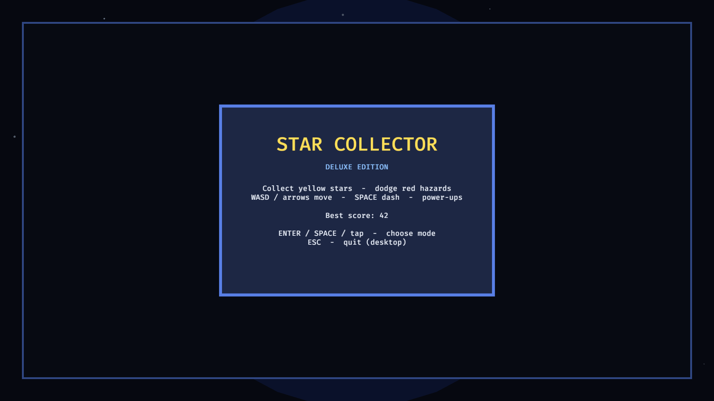
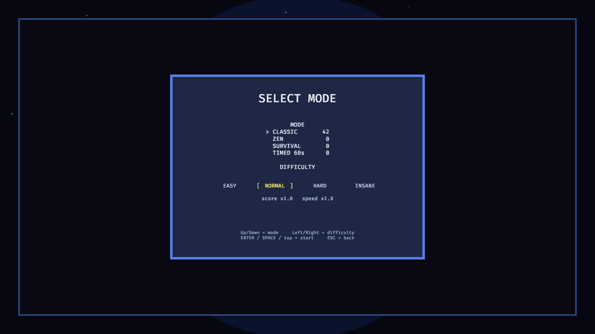
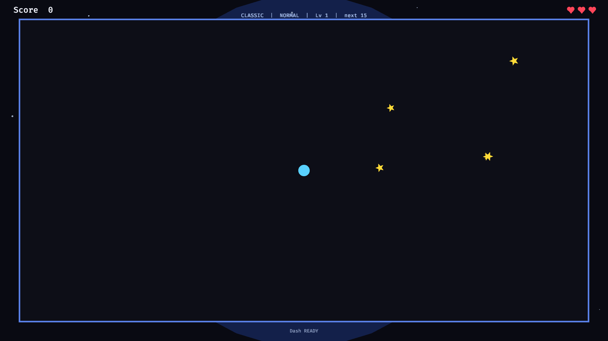

# Star Collector

<p align="center">
  <strong>A polished 2D arcade game in Rust + Bevy 0.19</strong><br/>
  Native desktop · WebAssembly · Touch-friendly
</p>

<p align="center">
  <em>An <a href="https://github.com/IntRUSTing-Games">IntRUSTing Games</a> project</em>
</p>

---

Collect yellow stars, dodge red hazards, chain combos, and grab power-ups.
Play in the browser or natively — same game, crisp vector meshes that scale from phone to 4K.

## Screenshots

| Menu | Mode select | Playing |
|------|-------------|---------|
|  |  |  |

More captures under [`screenshots/`](screenshots/).

## Play

### Desktop

```bash
cargo run                 # play
cargo run -- --screenshots  # refresh screenshots/
cargo build --release
```

### Browser (WASM)

```bash
rustup target add wasm32-unknown-unknown
# install trunk: https://trunkrs.dev /

./scripts/web-build.sh          # → ./dist  (~46MB WASM)
./scripts/web-serve-dist.sh     # http://127.0.0.1:8080/
# live reload:
./scripts/web-serve.sh
```

Ship the `dist/` folder to any static host (itch.io, GitHub Pages, Cloudflare Pages, nginx).

> After rebuilds, `web-build.sh` clears Firefox’s disk cache so you don’t get stale-WASM `TypeError`s.

## Controls

| Input | Action |
|-------|--------|
| **WASD** / arrows | Move |
| **Space** / tap right edge | Dash |
| **Enter** / tap | Confirm / start / retry |
| **Escape** | Back / menu |
| **Up / Down** | Mode select — mode |
| **Left / Right** (or **A / D**) | Mode select — difficulty |
| Drag | Move (mouse / touch) |

High scores: `save_data.json` on desktop, **localStorage** on web.

## Modes & difficulty

| Mode | Rules |
|------|--------|
| **Classic** | 3 hearts, levels, rising intensity |
| **Zen** | No hazards — pure collecting |
| **Survival** | 1 heart, aggressive spawns |
| **Timed** | 60-second score attack |

| Difficulty | Speed | Score |
|------------|-------|-------|
| Easy | ×0.85 | ×0.75 |
| Normal | ×1.0 | ×1.0 |
| Hard | ×1.3 | ×1.5 |
| Insane | ×1.65 | ×2.5 |

## Features

- Bevy 0.19 ECS, modular sources (`player`, `world`, `ui`, …)
- Resolution-independent mesh graphics (phone → 4K)
- Combos, magnet / shield / speed power-ups
- Dash trails, shockwaves, floating score pops, screen shake
- Touch + keyboard + mouse
- Screenshot tour: `cargo run -- --screenshots`

## Project layout

```
src/           game code
assets/        sprites + OGG SFX
scripts/       web build / serve / Firefox cache clear
screenshots/   visual QA
web/           browser CSS
index.html     Trunk entry (WASM boot UI)
```

## System deps (Linux)

**Fedora**

```bash
sudo dnf install gcc-c++ libX11-devel alsa-lib-devel systemd-devel \
  wayland-devel libxkbcommon-devel pkgconf-pkg-config
```

**Debian / Ubuntu**

```bash
sudo apt-get install g++ pkg-config libx11-dev libasound2-dev libudev-dev \
  libwayland-dev libxkbcommon-dev
```

## License

[MIT](LICENSE) © IntRUSTing Games
